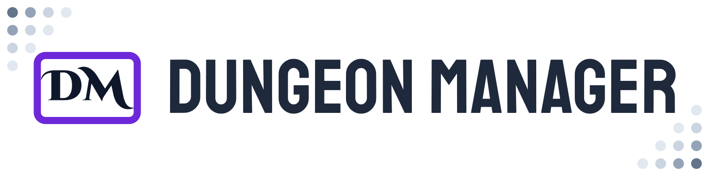

The goal of Dungeon Manager is to create a tool for Dungeon Masters to organize different online tools for running the game.

# Current Features

## Images

Upload images here to share them with your group. Click an image to set it as active. Best used with an extra screen to share character art & scenery with your players.

## Music

Add your favorite music, ambient soundtracks, and playlists from Youtube to control playback throughout the application.

# Roadmap

- Spotify Music Integration
  - Users with a Spotify premium account should be able to control spotify playback through Dungeon Master
- Smart Home support
  - By integrating with [Home Assistant](https://www.home-assistant.io/), I hope to be able to create & control lighting scenes, as well as create a pathway for other smart home integrations.
- Embed Support
  - We can't support every tool used by every DM. By allowing users to embed outside websites, DMs can create their own experiences
